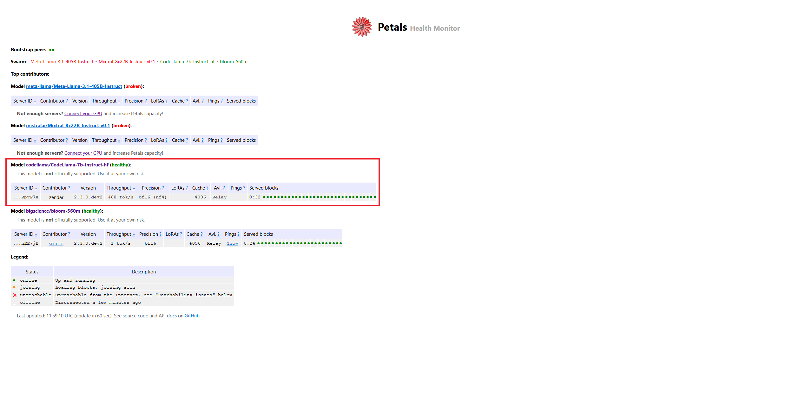
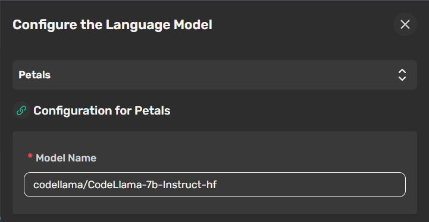

<a name="readme-top"></a>

<!-- PROJECT LOGO -->
<br />
<div align="center">
  <h2>Cheshire Cat AI (Stregatto) + Petals</h2>
<br/>
  <a href="https://github.com/cheshire-cat-ai/core">
  
</a>
  <a href="https://discord.gg/bHX5sNFCYU">
        </a>
  <a href="https://github.com/cheshire-cat-ai/core/issues">
  
  </a>
  <a href="https://github.com/cheshire-cat-ai/core/tags">
  
  </a>
  

  <br/>
  <video src="https://github.com/cheshire-cat-ai/core/assets/6328377/7bc4acff-34bf-4b8a-be61-4d8967fbd60f"></video>
</div>

## AI agent as a microservice

The Cheshire Cat is a framework to build custom AI agents:

- ⚡️ API first, to easily add a conversational layer to your app
- 💬 Chat via WebSocket and manage your agent with an customizable REST API
- 🐘 Built-in RAG with Qdrant
- 🚀 Extensible via plugins
- 🪛 Event callbacks, function calling (tools), conversational forms
- 🏛 Easy to use admin panel
- 🌍 Supports any language model via langchain
- 👥 Multiuser with granular permissions, compatible with any identity provider
- 🐋 100% dockerized
- 🦄 Active [Discord community](https://discord.gg/bHX5sNFCYU) and easy to understand [docs](https://cheshire-cat-ai.github.io/docs/)
- 🌸 This branch add [Petals](https://health.petals.dev/) support to Cheshire Cat. 🆕

## What is Petals?

Run large language models at home, BitTorrent‑style, see [homepage](https://petals.dev/) and find more on [github](https://github.com/bigscience-workshop/petals) page.

## Prerequisites

1. Huggingface account, sign up [here](https://huggingface.co/join)

## What you need to do

1. check Petals' [health status](https://health.petals.dev/) page and choose your preferred model
2. Request access to huggingface weights for the model that you want to use, find more [here](https://huggingface.co/docs/hub/models-gated#gated-models)
3. Generate your huggingface [token](https://huggingface.co/settings/tokens)
(usually they grants access in few minutes). When selecting token permission check `Read access to contents of all public gated repos you can access` option under `Repositories` group.
4. Once your token is created, create an `.env` file by duplicating `.env.example` and fill `HUGGINGFACE_TOKEN` it with your token.

## How to Cheshire Cat with Petals

To run cheshire cat with Petals, follow these steps:

> [!IMPORTANT]
> Don't enable DEBUG mode in .env file otherwise this will interfere with Petals

1. append settings from `.env.petals.example` into `.env`
1. fill .env file with the desired settings
2. run `docker compose -f compose.petals.yml up -d`

### Petals container setup
1. The Petals container should start. Inside log you will see that is loading model blocks. 

```
...
2024-10-27 12:31:59 petals                      | Login successful
2024-10-27 12:32:00 petals                      | /home/petals/src/petals/server/block_functions.py:165: SyntaxWarning: assertion is always true, perhaps remove parentheses?
2024-10-27 12:32:00 petals                      |   assert (
2024-10-27 12:32:00 petals                      | Oct 27 11:32:00.715 [INFO] Running Petals 2.3.0.dev2
2024-10-27 12:32:01 petals                      | Oct 27 11:32:01.116 [INFO] Make sure you follow the Llama terms of use: https://llama.meta.com/llama3/license, https://llama.meta.com/llama2/license
2024-10-27 12:32:01 petals                      | Oct 27 11:32:01.116 [INFO] Using DHT prefix: CodeLlama-7b-Instruct-hf
2024-10-27 12:32:12 petals                      | Oct 27 11:32:12.757 [INFO] This server is accessible via relays
2024-10-27 12:32:14 petals                      | Oct 27 11:32:14.059 [INFO] Connecting to the public swarm
2024-10-27 12:32:14 petals                      | Oct 27 11:32:14.059 [INFO] Running a server on ['/ip4/127.0.0.1/tcp/31330/p2p/12D3KooWEbeDea5LSiaJEBuWLYh85h8kPgTXM8UNYo7bUCRpvP7X', '/ip4/172.18.0.2/tcp/31330/p2p/12D3KooWEbeDea5LSiaJEBuWLYh85h8kPgTXM8UNYo7bUCRpvP7X', '/ip6/::1/tcp/31330/p2p/12D3KooWEbeDea5LSiaJEBuWLYh85h8kPgTXM8UNYo7bUCRpvP7X']
2024-10-27 12:32:14 petals                      | Oct 27 11:32:14.219 [INFO] Model weights are loaded in bfloat16, quantized to nf4 format
2024-10-27 12:32:14 petals                      | Oct 27 11:32:14.219 [INFO] Attention cache for all blocks will consume up to 2.00 GiB
2024-10-27 12:32:14 petals                      | Oct 27 11:32:14.220 [INFO] Loading throughput info
2024-10-27 12:32:14 petals                      | Oct 27 11:32:14.239 [INFO] Reporting throughput: 467.9 tokens/sec for 32 blocks
2024-10-27 12:32:18 petals                      | Oct 27 11:32:18.175 [INFO] Announced that blocks [0, 1, 2, 3, 4, 5, 6, 7, 8, 9, 10, 11, 12, 13, 14, 15, 16, 17, 18, 19, 20, 21, 22, 23, 24, 25, 26, 27, 28, 29, 30, 31] are joining
2024-10-27 12:34:02 petals                      | Oct 27 11:34:02.638 [INFO] Loaded codellama/CodeLlama-7b-Instruct-hf block 0
2024-10-27 12:34:08 petals                      | Oct 27 11:34:08.157 [INFO] Loaded codellama/CodeLlama-7b-Instruct-hf block 1
2024-10-27 12:34:13 petals                      | Oct 27 11:34:13.249 [INFO] Loaded codellama/CodeLlama-7b-Instruct-hf block 2
2024-10-27 12:34:17 petals                      | Oct 27 11:34:17.088 [INFO] Loaded codellama/CodeLlama-7b-Instruct-hf block 3
2024-10-27 12:34:21 petals                      | Oct 27 11:34:21.051 [INFO] Loaded codellama/CodeLlama-7b-Instruct-hf block 4
2024-10-27 12:34:24 petals                      | Oct 27 11:34:24.946 [INFO] Loaded codellama/CodeLlama-7b-Instruct-hf block 5
2024-10-27 12:34:28 petals                      | Oct 27 11:34:28.609 [INFO] Loaded codellama/CodeLlama-7b-Instruct-hf block 6
2024-10-27 12:34:32 petals                      | Oct 27 11:34:32.714 [INFO] Loaded codellama/CodeLlama-7b-Instruct-hf block 7
2024-10-27 12:34:36 petals                      | Oct 27 11:34:36.334 [INFO] Loaded codellama/CodeLlama-7b-Instruct-hf block 8
2024-10-27 12:34:40 petals                      | Oct 27 11:34:40.247 [INFO] Loaded codellama/CodeLlama-7b-Instruct-hf block 9
2024-10-27 12:34:43 petals                      | Oct 27 11:34:43.998 [INFO] Loaded codellama/CodeLlama-7b-Instruct-hf block 10
2024-10-27 12:34:49 petals                      | Oct 27 11:34:49.203 [INFO] Loaded codellama/CodeLlama-7b-Instruct-hf block 11
2024-10-27 12:34:54 petals                      | Oct 27 11:34:54.436 [INFO] Loaded codellama/CodeLlama-7b-Instruct-hf block 12
2024-10-27 12:34:59 petals                      | Oct 27 11:34:59.354 [INFO] Loaded codellama/CodeLlama-7b-Instruct-hf block 13
2024-10-27 12:35:04 petals                      | Oct 27 11:35:04.460 [INFO] Loaded codellama/CodeLlama-7b-Instruct-hf block 14
2024-10-27 12:35:09 petals                      | Oct 27 11:35:09.608 [INFO] Loaded codellama/CodeLlama-7b-Instruct-hf block 15
2024-10-27 12:35:14 petals                      | Oct 27 11:35:14.763 [INFO] Loaded codellama/CodeLlama-7b-Instruct-hf block 16
2024-10-27 12:35:19 petals                      | Oct 27 11:35:19.843 [INFO] Loaded codellama/CodeLlama-7b-Instruct-hf block 17
2024-10-27 12:35:24 petals                      | Oct 27 11:35:24.982 [INFO] Loaded codellama/CodeLlama-7b-Instruct-hf block 18
2024-10-27 12:35:29 petals                      | Oct 27 11:35:29.732 [INFO] Loaded codellama/CodeLlama-7b-Instruct-hf block 19
2024-10-27 12:35:34 petals                      | Oct 27 11:35:34.720 [INFO] Loaded codellama/CodeLlama-7b-Instruct-hf block 20
2024-10-27 12:35:39 petals                      | Oct 27 11:35:39.750 [INFO] Loaded codellama/CodeLlama-7b-Instruct-hf block 21
2024-10-27 12:35:44 petals                      | Oct 27 11:35:44.851 [INFO] Loaded codellama/CodeLlama-7b-Instruct-hf block 22
2024-10-27 12:35:49 petals                      | Oct 27 11:35:49.791 [INFO] Loaded codellama/CodeLlama-7b-Instruct-hf block 23
2024-10-27 12:36:46 petals                      | Oct 27 11:36:46.508 [INFO] Loaded codellama/CodeLlama-7b-Instruct-hf block 24
2024-10-27 12:36:50 petals                      | Oct 27 11:36:50.304 [INFO] Loaded codellama/CodeLlama-7b-Instruct-hf block 25
2024-10-27 12:36:54 petals                      | Oct 27 11:36:54.170 [INFO] Loaded codellama/CodeLlama-7b-Instruct-hf block 26
2024-10-27 12:36:57 petals                      | Oct 27 11:36:57.812 [INFO] Loaded codellama/CodeLlama-7b-Instruct-hf block 27
2024-10-27 12:37:01 petals                      | Oct 27 11:37:01.571 [INFO] Loaded codellama/CodeLlama-7b-Instruct-hf block 28
2024-10-27 12:37:05 petals                      | Oct 27 11:37:05.411 [INFO] Loaded codellama/CodeLlama-7b-Instruct-hf block 29
2024-10-27 12:37:09 petals                      | Oct 27 11:37:09.223 [INFO] Loaded codellama/CodeLlama-7b-Instruct-hf block 30
2024-10-27 12:37:13 petals                      | Oct 27 11:37:13.155 [INFO] Loaded codellama/CodeLlama-7b-Instruct-hf block 31
2024-10-27 12:37:17 petals                      | Oct 27 11:37:17.658 [INFO] Server is reachable from the Internet. It will appear at https://health.petals.dev soon
2024-10-27 12:37:17 petals                      | Oct 27 11:37:17.862 [INFO] Started
```

2. Once finished, check Petals [health status](https://health.petals.dev/) page to see if your model is ready.



## Petals LLM Config

1. Login in Cheshire Cat
2. Go to the plugin page.
3. Activate the [cat-on-petals](https://github.com/scicco/cat-on-a-petals) plugin.
4. Go to the settings page.
5. Click on "Configure" under Large Language Model section.
6. Select the "Petals" model.
7. Insert the desired model
8. Insert the huggingface token
9. Save your settings.



## Quickstart

To make Cheshire Cat run on your machine, you just need [`docker`](https://docs.docker.com/get-docker/) installed:

```bash
docker run --rm -it -p 1865:80 ghcr.io/cheshire-cat-ai/core:latest
```
- Chat with the Cheshire Cat on [localhost:1865/admin](http://localhost:1865/admin)
- Try out the REST API on [localhost:1865/docs](http://localhost:1865/docs)

Enjoy the Cat!  
Follow instructions on how to run it properly with [docker compose and volumes](https://cheshire-cat-ai.github.io/docs/quickstart/installation-configuration/).

## Minimal plugin example

<details>
    <summary>
        Hooks (events)
    </summary>

```python
from cat.mad_hatter.decorators import hook

# hooks are an event system to get finegraned control over your assistant
@hook
def agent_prompt_prefix(prefix, cat):
    prefix = """You are Marvin the socks seller, a poetic vendor of socks.
You are an expert in socks, and you reply with exactly one rhyme.
"""
    return prefix
```
</details>

<details>
    <summary>
        Tools
    </summary>

```python
from cat.mad_hatter.decorators import tool

# langchain inspired tools (function calling)
@tool(return_direct=True)
def socks_prices(color, cat):
    """How much do socks cost? Input is the sock color."""
    prices = {
        "black": 5,
        "white": 10,
        "pink": 50,
    }

    price = prices.get(color, 0)
    return f"{price} bucks, meeeow!" 
```
</details>

<details>
    <summary>
        Conversational Forms
    </summary>

## Conversational form example

```python
from pydantic import BaseModel
from cat.experimental.form import form, CatForm

# data structure to fill up
class PizzaOrder(BaseModel):
    pizza_type: str
    phone: int

# forms let you control goal oriented conversations
@form
class PizzaForm(CatForm):
    description = "Pizza Order"
    model_class = PizzaOrder
    start_examples = [
        "order a pizza!",
        "I want pizza"
    ]
    stop_examples = [
        "stop pizza order",
        "not hungry anymore",
    ]
    ask_confirm = True

    def submit(self, form_data):
        
        # do the actual order here!

        # return to convo
        return {
            "output": f"Pizza order on its way: {form_data}"
        }
```
</details>

## Docs and Resources

- [Official Documentation](https://cheshire-cat-ai.github.io/docs/)
- [Discord Server](https://discord.gg/bHX5sNFCYU)
- [Website](https://cheshirecat.ai/)
- [Tutorial - Write your first plugin](https://cheshirecat.ai/write-your-first-plugin/)


## Roadmap & Contributing

Detailed roadmap is [here](./ROADMAP.md).  
Send your pull request to the `develop` branch. Here is a [full guide to contributing](./CONTRIBUTING.md).

We are committed to openness, privacy and creativity, we want to bring AI to the long tail. If you want to know more about our vision and values, read the [Code of Ethics](./CODE-OF-ETHICS.md). 

Join our [community on Discord](https://discord.gg/bHX5sNFCYU) and give the project a star ⭐!
Thanks again!🙏

## License and trademark

Code is licensed under [GPL3](./LICENSE).  
The Cheshire Cat AI logo and name are property of Piero Savastano (founder and maintainer).

## Which way to go?

<p align="right">(<a href="#readme-top">back to top</a>)</p>

<p align="center">
    
</p>

```
"Would you tell me, please, which way I ought to go from here?"
"That depends a good deal on where you want to get to," said the Cat.
"I don't much care where--" said Alice.
"Then it doesn't matter which way you go," said the Cat.

(Alice's Adventures in Wonderland - Lewis Carroll)

```
